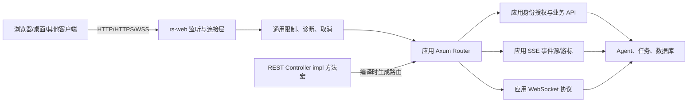

# rs-web 详细设计方案

> 日期：2026-10-08；状态：历史技术决策记录（实施后对照见下文）；目标仓库：`qubit-ltd/rs-web`；Cargo 包名：`qubit-web`。本文保留决策过程；现行操作方式见[用户指南](user_guide.md)与[中文版](user_guide.zh_CN.md)，需求基准见[PRD](2026-10-08-rs-web-prd.md)。

## 实施状态对照（2026-10-08）

- **已实现：** 本文首版描述的主要 HTTP/HTTPS、Controller、JSON、SSE、WebSocket 和 shutdown API；具体可用 feature 以 `Cargo.toml` 为准。
- **本轮方案已实施：** `ServerOptions::with_max_transport_connections` 默认 1024，许可在 accept 前取得；满额时服务停止 accept，客户端可能等待或连接失败，不产生保证的 503。HTTP/1 请求头默认 10 秒，HTTPS TLS 握手沿用此 timeout；不对 HTTP/2 首帧/空闲作同等承诺。
- **本轮方案已实施：** `ConfiguredWeb` 将 `ServerOptions` 与 `HttpLimits` 分开返回。HTTP 限额须由应用在适当短路由显式安装。context 型 SSE/WS 进入 `ServerContext::active_sessions()`；仅接收 cancellation token 的 WS 入口不计入该统计。
- **非目标仍然有效：** 本库不提供应用认证/授权、SSE 事件重放或业务协议。`prompt_stream` 的 demo token 仅用于示例，不能作为生产认证。

以下章节记录首版设计及决策脉络；当历史愿景描述与当前 API 或上方实现合同不同，按上方合同和用户指南理解。

## 1. 目标、输入与判据

多个产品采用相似的交互：前端提交 Prompt，Rust 后端调用 Agent 执行任务，并通过 HTTP 响应、流式事件或双向连接向前端返回状态。VibeCAD 第 7 期提供了一个具体样例：HTTP/JSON 承接业务请求，SSE 展示进度，WebSocket 承载双向 CAD 协议；其他产品的任务协议可以不同。公共库需要解决网络服务端的重复工程，而不要求这些产品共享 Agent 领域模型。

首版成功的判据：

1. 同一个 Axum `Router` 可在显式 HTTP 或 HTTPS 监听上运行；HTTPS 连接上的 WebSocket 自动成为 WSS。
2. HTTP 请求体、严格 JSON、WebSocket 帧/消息、在途连接和发送队列都有可设置且实际生效的有限上界；越限产生可识别的结果。
3. SSE 和 WebSocket 长连接可持续工作、感知断开，并在服务停止时有界退出；普通请求的超时不会误杀长连接。
4. 应用可用 REST Controller 属性宏声明接口，也可原生使用 Axum 的 `Router`、`State`、extractor、middleware、`Sse` 和 `WebSocketUpgrade`；不要求全局注册表或 IoC 容器。
5. 至少用两个独立的示例服务检验复用：一个 Prompt/Agent 风格的 HTTP+SSE+WS 服务，一个用 Controller 宏编写的非 Agent JSON CRUD 服务。示例不宣称模拟了真实 Agent 或持久化。
6. `cargo test --all-features`、Rustdoc、格式和当前 rs-infra 检查通过；自签名 TLS 测试只在测试环境使用，公开服务须用可信证书或可信 TLS 终结层。

`rs-http` 继续只负责 Rust 客户端。`rs-web` 不依赖 `rs-http`，避免客户端栈（如 reqwest、代理、重试）进入服务端依赖图。

## 2. 参考实现及方案比较

本地参考：`~/working/github/summer-rs/summer-web`、`~/working/github/summer-rs/summer-macros`、`~/working/qubit/rust-common/rs-http`、`rs-argument`，以及 VibeCAD 第 7 期 `backend/server` 和通信设计。`summer-web` 使用 Axum、Tower middleware、配置与插件装配。其 `#[get]`/`#[post]`/`#[route]` 标记函数，`#[routes]` 支持一个函数绑定多个路径或方法，`#[nest]` 给模块加前缀；生成的 `TypedHandlerRegistrar` 可通过 `typed_route` 显式装配，也可借助 `inventory` 自动发现。`rs-web` 借鉴这一声明式路由体验，并补足结构体 Controller 的 `impl` 方法标记；有状态 Controller 实例显式进入 Router，不复制 Summer 应用容器与插件面。

| 方案 | 优点 | 成本与限制 | 结论 |
| --- | --- | --- | --- |
| 各项目直接使用 Axum | 零公共维护成本 | 重复处理 TLS、连接限制、流式超时、隐私日志与错误边界，行为容易分叉 | 作为短期实现可行，不是多项目长期目标 |
| 将 `rs-http` 扩展成双向 HTTP 库 | 名称下功能集中 | 客户端 reqwest 策略与服务端生命周期耦合，feature 和依赖变重 | 不采用 |
| 独立的 `rs-web` + 过程宏 crate | 共享服务端能力与声明式 REST 接口，同时保留 Axum 原生接口 | 要维护运行时与宏展开的兼容合同 | **采用** |

首版以 HTTP/HTTPS/WebSocket 为协议范围。SSE 是 HTTP 的流式响应，支持 Axum 原生 `Sse` 并提供必要的连接约束；不把 SSE、JSON-RPC、Agent 工作流视作独立的传输栈。

## 3. 职责边界



`rs-web` 拥有：REST 属性宏及生成路由的装配合同、服务启动/停止、HTTP/HTTPS 监听、TLS 配置加载、通用请求限制、严格 JSON 的可选提取器、隐私安全的基础诊断、SSE/WS 的连接约束、类型化基础设施错误。应用拥有：具体路径及方法、Controller 实例与依赖、认证与授权决策、Prompt、Agent、任务状态、事件 ID/游标、历史重放、幂等键、业务错误格式、JSON-RPC/CIP 等应用协议、数据库、跨实例协调和部署环境。

公共层不推断“HTTP 202 表示 Agent 成功”，也不把 WebSocket 发送成功当作业务 ACK。对失败的业务操作，公共层不自动重试；重试语义需要幂等键或领域台账，由应用和客户端决定。

## 4. 首版模块与公共 API 草案

模块按责任拆分；以下名称是目标 API，实施时可因编译可行性作小幅命名调整，但语义边界应保持。

| 模块 | 公开类型/函数草案 | 职责 |
| --- | --- | --- |
| `server` | `WebServer`, `ServerOptions`, `ShutdownReport`, `bind_http`, `bind_https` | 持有已绑定监听、运行 Router、停止及地址查询 |
| `mvc` | `ControllerRoutes`, `RouterExt` | 接收宏生成的路由描述，检查 Controller 间冲突并装配 Axum Router |
| `qubit-web-macros` | `rest_controller`, `get_mapping` 等、`get` 等短别名、`route` | 编译期解析属性并生成无反射的路由代码；由 `qubit-web` 重导出 |
| `tls`（`tls-rustls` feature） | `TlsConfig::from_pem_files`, `TlsConfig::from_rustls` | 证书/密钥加载与明确失败；TLS 终结复用同一 Router |
| `limit` | `HttpLimits`, `RequestLimitLayer`, `WsLimits` | HTTP body 与 WS 大小/连接/队列约束；每路由可覆盖 |
| `json`（`json` feature） | `BoundedJson<T>`, `JsonLimits` | 严格 JSON、输入/结构预算及响应编码预算 |
| `ws`（`ws` feature） | `WsUpgradePolicy`, `WsSession`, `WsSendQueue` | 握手限制、长连接取消、心跳和有界发送 |
| `sse` | `SseConnectionPolicy` | 长连接保活/关闭与配置辅助；事件源及游标归应用 |
| `diagnostic` | `WebServerError`, `WebRejection` | 区分配置/绑定/TLS/容量/协议错误；日志脱敏 |

基础应用仍可直接装配原生 Router：

```rust,ignore
use axum::{Router, routing::get};
use qubit_web::{ServerOptions, WebServer};

let app = Router::new().route("/health", get(|| async { "ok" }));
let options = ServerOptions::new("127.0.0.1:0".parse()?);
let server = WebServer::bind_http(options).await?;
let bound_addr = server.local_addr();
server.serve(app, shutdown_signal).await?;
```

`Router<()>` 表示应用已经提供其状态，可以交给运行层；`rs-web` 不要求应用使用特定 `State`。`bind_http` 先绑定并返回真实地址，便于端口 0 测试和就绪通知。HTTPS 使用对称的 `bind_https(options, tls_config)`；证书格式/密钥不合法时在对外提供服务前返回错误。运行层不偷偷注册 `/health` 或改写业务路径。

`WebServer` 是尚未运行且已绑定的服务；`serve(...)` 消费它并阻塞至退出。首版不同时提供独立 `ServerHandle`，避免两个相互竞争的停止入口。`serve(...)` 返回 `Result<ShutdownReport, WebServerError>`：正常退出的报告标明是否超期以及被强制关闭的连接数；监听或 TLS 故障返回结构化错误。调用方可自行 `tokio::spawn`，并持有 shutdown token 及任务句柄。

### 4.1 REST Controller 宏与路由装配

下面是目标用法示意，最终名称和泛型边界以可编译的最小实现为准：

```rust,ignore
use std::sync::Arc;
use axum::extract::{Path, Query};
use qubit_web::{ControllerRoutes, BoundedJson, get_mapping, post_mapping, rest_controller};

struct UsersController { service: Arc<UserService> }

#[rest_controller("/users")]
impl UsersController {
    #[get_mapping("/{id}")]
    async fn show(&self, Path(id): Path<u64>) -> Result<impl IntoResponse, AppError> {
        self.service.find(id).await
    }

    #[post_mapping("")]
    async fn create(&self, BoundedJson(input): BoundedJson<CreateUser>)
        -> Result<impl IntoResponse, AppError> {
        self.service.create(input).await
    }
}

let users = Arc::new(UsersController { service });
let app = ControllerRoutes::new()
    .add(users)?
    .finish()?;
let app = app.merge(hand_written_router);
```

示例的 `BoundedJson` 需要开启 `json` feature；代码块展示目标调用形态，具体 trait 约束需通过跨 crate 编译测试锁定。

`#[rest_controller]` 只接受固有 `impl`，前缀必须是以 `/` 开始且不带尾部 `/` 的静态字符串；根路径使用 `/`。子路径为 `""` 或以 `/` 开始的静态字符串，拼接时恰好有一个斜杠。采用 Axum 0.8 的 `{id}` 路径参数语法。`#[get_mapping]`、`#[post_mapping]`、`#[put_mapping]`、`#[patch_mapping]`、`#[delete_mapping]` 是 Spring 风格的 Rust 命名；`#[get]` 等短名称与 Summer 用法一致，二者在 Controller 方法上展开为相同路由语义。`#[route("/x", method = "GET", method = "HEAD")]` 支持多方法绑定。一次 `add(controller)` 注册整个 Controller，应用无需逐个 `Router::route`。独立函数可继续按 Axum 原生方式注册，首版不为它提供属性宏。

宏在展开时生成私有适配 handler 和静态路由元数据；`ControllerRoutes` 聚合元数据，预先检查相同 HTTP 方法+完整路径冲突，随后调用 Axum `Router::route`/`nest`。路由元数据不扫描运行时类型，也不要求 `inventory`。此选择与 Summer 的自动发现不同：有状态 Controller 需要应用显式提供实例和依赖，隐式全局发现无法安全创建这些对象。与手写 Router 合并时遵守 Axum 的冲突行为，公共构建器只能诊断自身收集的声明式路由。

`&self` 由生成的适配 handler 使用 `Arc<Controller>` 持有，实例通过私有新类型放入路由 Extension，避免与应用自己的 `Extension<Arc<T>>` 冲突。方法其余参数照常走 Axum extractor；需要 JSON 资源预算时应用写 `BoundedJson<T>`，普通 `Json<T>` 只受 HTTP body 字节限制。宏不自动改变业务错误体、响应状态或认证要求。若应用使用 `State<S>`，生成 Router 在最终调用 `with_state` 前保留 Axum 的缺失状态类型，不偷偷制造独立全局状态。Controller 分支可挂载认证与 limit middleware，生成 handler 不绕过这些层。

编译期拒绝非异步方法、不支持的 receiver（如 `self` 按值或 `&mut self`）、动态路径、未知 HTTP 方法、重复属性，以及同一 Controller 内可静态判定的重复方法+路径。跨 Controller 的冲突由 `ControllerRoutes::add`/`finish` 返回装配错误；不会等到收到请求才失败。应用可继续手写更复杂的 Axum 路由，特别是 SSE/WS；若声明式方法返回 SSE 或升级 WS，必须显式挂长连接策略，不能继承普通总请求期限。

`qubit-web-macros` 是独立 `proc-macro` 包，只依赖 `syn`/`quote`/`proc-macro2` 等编译时工具；生成代码使用 `::qubit_web` 的公开稳定适配 API。主包默认重导出宏，让消费者只需依赖 `qubit-web`。实现时须用 `trybuild` 覆盖不合法语法，并编译验证跨 crate 使用、Axum 状态提取、控制器 `&self` 生命周期及与原生 Router 混合装配。

## 5. HTTP 与 HTTPS

### 5.1 监听与 TLS

基础 HTTP 使用 Axum 0.8/Tokio 监听；`tls-rustls` feature 使用 `axum-server` 0.8 的 rustls 集成。官方 Axum TLS 示例也采用 `axum-server`；借用成熟的 accept/TLS 服务封装，比在本 crate 自写 Hyper/Tokio-Rustls accept loop 更容易控制 API 与维护风险。两种监听使用同一个 `Router` 与相同的请求层。HTTPS 上的 `WebSocketUpgrade` 自然协商 WSS；不单独启动另一个 WS 服务器。

必须显式指定监听地址和模式。示例与测试使用 loopback；公开绑定需由部署者提供可信 HTTPS 或明确的可信反向代理 TLS 终结。反向代理模式不默认信任 `Forwarded`/`X-Forwarded-*`，真实客户端 IP、scheme 与主机名只有在应用配置了受信代理范围后才可采用。首版不提供证书签发/续期和热重载，但允许调用方传入已构建的 rustls 配置，为后续安全轮换留接口。TLS 私钥内容绝不进入错误或日志。

### 5.2 请求限制与响应

HTTP 请求体提供全局默认上限和路由级覆盖，预先检查可信的 `Content-Length`，并对实际读取的字节继续计数；分块传输或伪造长度不能绕过限制。超过上限返回 413。不得把 `Content-Length` 当成已经收到/持久化的事实。上传/下载可由应用使用 Axum body stream；公共层只实施字节边界和取消，不默认缓冲大资源。

普通 API 可配置请求处理期限与并发上限。SSE/WS 路由通过明确的长连接策略排除普通总请求超时；它们仍受握手时间、空闲时间、连接总数和关闭期限限制。不要把 Tower 的全局 `TimeoutLayer` 直接套在持续响应上。并发限制要区分短请求的在途数与长连接占用，防止少量 SSE/WS 长连接耗尽普通 API 许可。拒绝容量过载时返回 503 或关闭握手，不把排队做成无界缓存。

保留 Axum extractor/middleware 的原生组合权。跨域策略默认不启用；若应用启用 CORS，必须显式列允许 origin/method/header。业务认证和授权仍由应用中间件执行，连接升级之前必须完成握手层认证；升级之后的每条业务消息还需由应用核对权限。

## 6. JSON、预算与错误

普通 Axum `Json<T>` 保持可用；需要统一资源约束的路由选用 `BoundedJson<T>`。它先做 HTTP 字节限制，再用 `qubit-json::decode::JsonDecoder` 和 `qubit-budget::json::JsonDecodeLimits` 严格解析。默认禁止宽松“清洗”JSON，避免对客户端输入默默修正。应用指定深度、节点、字符串、数值和总输入预算；默认值须有限且在文档中给出，并允许按路由收紧或显式放宽。JSON 输出使用 `qubit-json::encode::JsonEncoder` 时同样设置输出预算，编码失败前不发送部分 JSON 响应。

基础设施拒绝区分：400（JSON 语法或参数结构）、413（请求字节或 JSON 资源越限）、415（不支持的内容类型）、503（服务容量/暂时不可用）。具体业务错误体由应用决定；`rs-web` 可为自己的拒绝生成小而稳定的 `application/problem+json` 内容，但不得替换应用既有错误 Schema。`WebServerError` 负责启动/停止失败，不与 HTTP 客户端的 `qubit-http::HttpError` 混用。公共错误及 Debug/Display 不包含请求正文、认证头、URL 敏感 query 或 TLS 私钥。

## 7. SSE 与 WebSocket

### 7.1 SSE 属于 HTTP 响应

应用直接使用 Axum `Sse` 产生事件。公共 `SseConnectionPolicy` 只集中 keep-alive、断线取消、最大连接数与关闭期限，并确保事件流的生产任务在客户端离开后可以终止。事件 `id`、`Last-Event-ID` 的解释、历史范围、缺口响应、任务快照和关键事件是否可丢弃，都取决于业务；`rs-web` 不提供内存事件台账并不声称可以恢复丢失事件。若应用生产 token 片段，应用自行决定是否合并/丢弃；关键终态必须由应用持久化后重放或查询。

SSE 响应应设置 `text/event-stream`、禁用会改变实时交付语义的缓冲/压缩策略，并定期发送保活；保活不是业务事件，也不推进事件游标。HTTP/2 下同样验证逐项可见性。客户端重连交给浏览器 EventSource 或 `rs-http` 的 SSE 客户端，不由服务端主动重试。

### 7.2 WebSocket 是双向传输

`WsUpgradePolicy` 在升级前处理可配置 Origin allowlist、身份中间件已确认的上下文、握手时限、最大帧与最大消息字节。若浏览器发送 `Origin` 且应用未配置允许范围，默认拒绝；无 Origin 的桌面/服务客户端仍需认证。`WsSession` 提供有限容量的发送队列、ping/pong 和空闲检测，处理对端关闭并在全局 shutdown 时发送 close；队列满返回明确背压错误或关闭连接，不静默丢弃通用消息。消息优先级、可丢片段与关键回执的差别由应用定义，公共层不猜测。

实现时必须分别限制：握手/连接数、单帧、重组后的单消息、发送队列项数及总排队字节；单靠 `max_message_size` 不能约束排队。禁止无限制 `tokio::spawn` 每消息任务。应用可选择文本/二进制消息并继续使用 Axum WebSocket 原生接口。`rs-web` 不内建 JSON-RPC、Socket.IO、CIP、Agent tool call 或自动重连；断线后结果是否未知以及如何对账由应用协议决定。

## 8. 停止、健康与可观测性

`WebServer` 接受调用方的 shutdown future/cancellation token，不安装进程级信号处理器；这样它能被桌面宿主、测试进程和其他服务框架共同使用。停止顺序为：停止接收新连接 → 通知 SSE/WS 会话 → 等待已在途短请求及长连接完成 → 到配置期限后终止剩余连接。已被业务接受的任务不会因为连接关闭被推断为取消；应用决定其任务清理和状态恢复。

默认 tracing 只记录方法、模板化路由、状态码、耗时、连接 ID 和大小。请求/响应 body、完整 URL query、授权头和 WebSocket 载荷不进入默认日志。显式诊断路径使用 `qubit-redact` 的 HTTP 策略，允许应用扩展敏感字段；即使 tracing subscriber 设置 TRACE，也不得绕过脱敏。基础设施只提供 readiness 组件状态（监听/TLS 可用）；业务 Worker、Agent、数据库和远端 Trace 的健康由应用汇总，不能以网络存活代替业务就绪。

## 9. 与现有 rs-* 的依赖关系

| crate | 选择 | 用途及边界 |
| --- | --- | --- |
| `qubit-redact` 0.9 | 首版依赖，启用 `http` | HTTP 上下文及错误诊断脱敏；不修改业务数据 |
| `qubit-budget` 0.7、`qubit-json` 0.10 | `json` feature | 结构/输入/输出预算和严格 JSON；HTTP 字节级限制仍由 body 层执行 |
| `qubit-config` 0.14 | 可选 `config` feature | 从现有配置源构造并验证 `ServerOptions`，不强制 TOML 或全局配置 |
| `qubit-retry` 0.26 | 首版不依赖 | 服务端不自动重试客户端写入；未来仅在明确幂等的内部出站操作中评估 |
| `qubit-reflect`、`qubit-ioc` | 首版不依赖，保留可选适配方向 | 原生 Axum `State` 足以装配路由。若至少两个项目确实需要容器注入/反射发现路由，再做独立 feature 或适配 crate，不进入核心请求路径 |
| `qubit-http` | 不依赖 | Rust 出站客户端；测试可用它做黑盒 HTTP/HTTPS/SSE 请求，但不组成运行时依赖环 |
| `qubit-event-bus`、`qubit-id`、`qubit-clock` | 按真实消费者再评估 | 事件持久化、领域 ID 和时间权威属于应用；基础心跳用 Tokio 时间即可 |

外部底座：Axum 0.8、Tokio、Tower/Tower-HTTP；`tls-rustls` feature 使用 `axum-server` 0.8/rustls；`ws` feature 使用 Axum 原生 WS。准确的最小兼容版本与 feature 组合在实施时通过 `cargo tree` 和 Cargo feature matrix 锁定。保持本仓库独立 Cargo workspace、Rust 1.94、现行 rs-infra bootstrap，不把其他 `rs-*` 项目复制进源码。

## 10. 仓库文件布局与分阶段交付

```text
rs-web/
  Cargo.toml
  qubit-web-macros/
    Cargo.toml
    src/lib.rs
    src/controller.rs
    src/route.rs
  src/
    lib.rs
    mvc.rs
    server.rs
    options.rs
    error.rs
    limit.rs
    tls.rs            # tls-rustls feature
    json.rs           # json feature
    sse.rs
    ws.rs             # ws feature
  tests/
    controller_routes.rs
    macro_compile_fail.rs
    http_server.rs
    https_server.rs
    json_limits.rs
    sse_lifecycle.rs
    websocket.rs
    shutdown.rs
  examples/
    controller_crud.rs
    prompt_stream.rs
  doc/
    2026-10-08-rs-web-design.md
```

实施顺序：

1. **HTTP 运行层**：绑定/地址/错误/显式 shutdown，加一个普通 Router 示例和本地端到端测试。
2. **声明式 REST**：建立宏 crate、结构体 `impl` 方法标记、一次装配、跨 crate 示例、编译失败测试和路由冲突测试。
3. **HTTPS**：可选 rustls、同一 Router、证书错误前置校验、自签名测试、WSS 握手测试。
4. **限制和诊断**：HTTP body、短请求并发、默认安全日志、`qubit-redact`，验证分块超限与凭据不泄漏；同样覆盖宏生成路由。
5. **JSON 和流式连接**：`BoundedJson`、SSE 长连接策略、WebSocket 限额/背压/心跳；验证慢消费者和停止。
6. **第二消费者检验**：非 Agent JSON CRUD 示例使用 Controller 宏，Prompt 示例使用宏与原生路由组合；完成 feature matrix、Rustdoc 与 rs-infra 检查。

首个实施阶段就应有可运行 HTTP 服务；后续阶段分别可测试。VibeCAD 第 7 期不依赖这些阶段完成，也不在本仓库设计任务中改动 VibeCAD 代码。等公共 API 稳定后，由各消费项目自行安排渐进接入和回归。

## 11. 验收矩阵

| 场景 | 期望证据 |
| --- | --- |
| HTTP 普通请求、路由状态与 404 | 本地监听、状态注入与 Axum 原生路由正常；库未注入额外路径 |
| REST Controller 宏 | CRUD 方法和路径前缀正确；`&self`、Path/Query/State/BoundedJson 可用；与原生 Router 组合 |
| 非法宏输入与装配冲突 | 不合法签名/路径/方法编译期报错；Controller 间重复路由返回装配错误 |
| HTTPS 与 WSS | 测试证书握手成功、明文误连被拒、同一路由可升级；证书缺失/错配阻止启动 |
| 请求体 `Content-Length` 与 chunked 超限 | 413 且读入内存有界，边界值恰好可通过 |
| 严格 JSON 与结构预算 | 非法语法、过深/过大、非预期内容类型分别得到明确拒绝；完整 `u64` 不因浮点转换丢精度 |
| SSE 慢读者、断开与普通请求并发 | 内存和任务数有界；断开取消生产；普通 API 不被长期连接饿死 |
| WS 大帧、分片重组、队列满与空闲 | 每种上限触发可观察的拒绝/关闭，连接不继续无限排队 |
| shutdown | 新连接停止、短请求完成、SSE/WS 收到关闭、超期连接被终止；无后台任务泄漏 |
| 日志隐私 | Authorization、Cookie、敏感 query、Prompt/body、TLS key 与 WS 消息不出现在默认和 TRACE 诊断中 |
| 各 feature 独立构建 | 默认、`json`、`ws`、`tls-rustls`、全 feature 均可编译测试；禁用可选 feature 不拉入对应重依赖 |

不把 HTTP 层测试当作应用幂等、SSE 事件重放或 Agent 执行成功的证据。那些场景由消费项目自己的合同和端到端测试负责。

## 12. 暂不纳入首版

OpenAPI 生成、全局自动路由发现、逐参数 Spring 风格别名宏、静态资源/SPA、文件上传的业务政策、OAuth/OIDC、会话数据库、Agent 任务协议、JSON-RPC 引擎、Socket.IO、自动证书管理、服务发现、反向代理、HTTP 客户端和自动请求重试。应用可继续直接使用 Axum/Tower 生态组件；若两个以上消费者重复实现同一能力，再按实际调用与测试决定是否进入 `rs-web`。

## 13. 详细技术合同

### 13.1 配置模型与覆盖顺序

`ServerOptions` 只包含服务级默认值、监听地址和关闭策略。按职责拆为 `HttpLimits`、`SseConnectionPolicy`、`WsLimits` 和可选 `JsonLimits`；各类型构造时就验证正值、字节/条数关系和期限。配置值统一使用 `NonZeroUsize`/`Duration` 等明确类型；对外不接受 `0 = unlimited`。默认数值与覆盖边界见 PRD 第 5 节，实施时不得隐式变为无限制。

应用应显式把策略层挂到希望受保护的 Router/route。当前 API 可从启用 `config` feature 后的 `ConfiguredWeb::http_limits()` 取得配置的限额，或直接构造 `HttpLimits`；将其传给 `ControllerRoutes::with_http_limits`，或在原生 Axum 分支显式安装 `RequestLimitLayer::new`。这里的 `ServerOptions::http_limits()` 是早期设计稿中的接口，实施时已删除。`WebServer` 保留调用方构造的 Router，不根据选项重写路由类别。Controller 的所有 short 路由共享一份服务级在途 limiter；路由级策略可以收紧/放宽字节上限或期限，但不复制服务级并发额度。SSE/WS 路由跳过普通短请求策略。组装顺序固定为：先确定路由与策略 → 前置容量/长度检查 → 应用认证及其他 middleware → body 消费/提取 → handler/流式响应。实际 Tower 层的执行方向与此不同写法时，以测试证明可观察顺序一致。应用若绕过公共限额层直接使用 Axum Router，文档必须明确该路由不享受相关约束；库不能声称自动覆盖任意原生 extractor。

| 配置域 | 默认 | 路由覆盖 | 运行时检查点 |
| --- | --- | --- | --- |
| Body 字节 | 1 MiB | 可放宽或收紧 | `Content-Length` 前检 + 实际 body stream 计数 |
| 短请求在途/期限 | 256 / 30 秒 | 期限可覆盖，在途额度使用独立 limiter | 握手完成后、调用 handler 前 |
| SSE 连接/保活 | 128 / 15 秒 | 可收紧连接数、调整保活 | 建立响应前获取 permit，stream drop 释放 |
| WS 连接/帧/消息 | 128 / 64 KiB / 1 MiB | 可收紧 | 升级前许可；读取帧与重组消息时校验 |
| WS 队列 | 64 条且 1 MiB | 可收紧 | 入队前同时预留条数与字节 |
| WS 握手/空闲 | 10 / 60 秒 | 可覆盖 | 升级前与会话状态机 |
| 关闭期限 | 30 秒 | 仅服务级 | 停止监听后开始计时 |

短请求并发许可覆盖整个响应体生命周期。对可能持续或大量下载的路由，应用需要单独分类、设置不同额度；普通总请求期限只保护明确纳入短请求策略的路由。SSE 和 WS 在升级/开始流式响应前取得独立许可，许可由响应流/会话持有，直到断开或强制关闭。容量不足时在读取业务 body 之前拒绝，避免排队等待许可。路由级覆盖要在路由构建时固定，不按未经校验的请求头动态改变。

### 13.2 HTTP body 与严格 JSON 数据路径

对声明了 `Content-Length` 的请求，若其数值大于上限则立即 413；未知长度或不可信长度继续按实际 body 数据帧累计。读取层必须在超出上限的那一帧停止，不能先聚合完整 body 再判断。若与其他提取器组合，公共 body 层负责字节上限，`BoundedJson<T>` 再负责结构预算。应用不得通过调用顺序规避 body 层。输入到达恰好上限时允许通过。

`BoundedJson<T>` 检查 `application/json` 及 `application/*+json`，允许合法 `charset=utf-8` 参数，拒绝其他媒体类型为 415。解析一次、反序列化一次，不做宽松修复或二次读取。`qubit-json` 与 `qubit-budget` 的实际 API 要在实施时通过编译验证；若其预算接口无法覆盖 PRD 中的某项资源，需先明确缺口与替代方案，不能把未受限路径标作已受限。响应侧提供独立的有界编码辅助；先把完整编码结果落入受预算控制的有界 buffer，成功后再构建响应，避免半个 JSON 已送出才报错。超输出预算是服务端编码错误，不能归为客户端 413。

JSON 处理的顺序为媒体类型 → body 字节 → JSON 语法与资源预算 → `T` 反序列化。错误类别分别保留，业务可转换成自己的响应；库自有拒绝返回稳定机器码。JSON 数值不可先经 `f64` 往返，特别要验证 `u64::MAX` 附近数值的精度。默认结构预算须在编码器/解码器类型说明中逐项列明，不能仅写“有限”。

默认 JSON 预算采用 PRD 第 5 节的数值：输入/输出各 1 MiB，深度 64，节点 100,000，数组项与对象项各 10,000，单 key 16 KiB，单 string 256 KiB，单 number 128 B，总 payload 1 MiB。`qubit-budget` 的 `JsonDecodeLimits::default()` 与 `JsonEncodeLimits::default()` 当前均不设置任何限制，因此 `rs-web` 必须显式构造每一项预算，不能直接采用它们的 `Default`。路径覆盖如提高 HTTP body 上限，JSON 输入上限不会自动提高，必须由应用另行显式配置。

### 13.3 SSE 会话与取消边界

`SseConnectionPolicy` 的组合器包装应用给出的 `Sse<Stream>`，在响应建立前取得 SSE permit，并创建供事件源使用的取消 token。封装流的 `Drop` 释放许可并触发取消；全局 shutdown 同样触发 token，然后允许事件源在关闭期限内送出最后事件。若应用在流外另起后台任务，必须显式监听 token，库无法自动取消任意 `tokio::spawn`。示例应展示此接线方式。

SSE 保活是注释帧，不携带事件 ID；代理侧需由部署者关闭缓冲，并验证 HTTP/1.1 和 HTTP/2 的逐项交付。库不保证网络对端已经消费事件；发送成功只说明数据交给传输层。慢消费者由响应体回压约束；若应用先把事件写入自己的 channel，channel 必须由应用设为有界。断线重连使用应用的事件存储与游标策略，不由公共层生成序号或持久化。

### 13.4 WebSocket 会话状态机

状态按 `PendingUpgrade → Active → Closing → Closed` 转移。`PendingUpgrade` 依次完成容量预留、Origin 规则检查与应用认证检查；Origin 只是一项浏览器来源防护，不代替身份认证。库只验证配置的允许列表，不解析业务身份。升级完成后 permit 转交会话；升级失败释放 permit。请求里有 Origin 而列表为空时拒绝，有明确允许列表时按精确 origin 比较；无 Origin 时交给应用认证规则。

`Active` 内部只有一个读取循环和一个写入循环。每条待发消息在入队前同时占用条数和字节预算；发送完成或会话关闭释放两者。`try_send` 在任一预算不足时立即返回 `Backpressure`，不挂起形成隐形队列；可另提供显式等待型发送，但必须支持取消及截止时间。收到 ping 则回复 pong；周期 ping 未在空闲期限内收到有效活动或 pong 时进入 `Closing`。帧大小和完整消息大小分别限制，重组预算不应因为分片绕过；超限使用适当 close code，例如 1009。应用分支可以继续使用原生 Axum WS 类型，但选择原生直通时文档须指出公共发送队列和心跳不再自动覆盖。

`Closing` 在全局 shutdown、对端 close、超限或空闲时触发。服务端发送 close 后继续读取对端 close ack；收到 ack 后刷新协议响应并释放许可。未收到 ack 时，在共享服务关闭 deadline 到期后丢弃传输和队列。通过 `WebServer` 提供的 `ServerContext` 调用 `WsUpgradePolicy::on_upgrade_with_context`，会把同一取消 token 和关闭期限传入会话；独立使用底层 token 版 `on_upgrade` 时，由 `WsUpgradePolicy::shutdown_timeout` 提供关闭期限，应用需保证它不大于服务期限。任何路径都只释放一次 permit。每条消息的业务任务、ACK、重放或优先级属于应用；库不自动 spawn 每消息任务，也不把入队或 socket 写入视为业务成功。

### 13.5 监听与服务关闭

HTTP/HTTPS 均在 `bind_*` 阶段先完成配置检查和 socket 绑定；HTTPS 还要加载证书与密钥并验证可构造 TLS acceptor。绑定后 `local_addr()` 可用于测试就绪。`serve(router, shutdown)` 将调用方的 future 作为唯一停止入口，不自行注册 SIGINT/SIGTERM。服务状态为 `Bound → Serving → Draining → Stopped`；`Serving` 前才报告监听就绪。

收到 shutdown 后先停止接受新连接，随后广播取消给 SSE/WS；普通已在途响应和配合取消的长连接可在 30 秒默认期限内结束。到期强制关闭尚在途连接，并形成 `ShutdownReport { graceful: bool, forced_connections: usize, elapsed: Duration }`。若底层服务器无法精确统计强制关闭的连接，不能填入猜测值；需改用可证明的会话跟踪计数或把字段改为 `Option<usize>` 并注明统计范围。TLS accept、监听和任务 join 错误应保留来源类别，但其 Display/Debug 必须过滤可能含密钥路径或内容的上下文。返回报告代表传输任务已终止，不代表业务任务已经完成。

### 13.6 错误与日志合同

| 阶段 | 类别/状态 | 稳定机器码示例 | 内容限制 |
| --- | --- | --- | --- |
| 配置/绑定/TLS | `WebServerError` variant | `invalid_config` / `bind_failed` / `tls_invalid` | 不打印私钥、原始请求数据 |
| body 超限 | 413 | `body_too_large` | 不回显 body |
| JSON 语法/类型 | 400 | `invalid_json` / `invalid_json_value` | 不回显原文片段 |
| JSON 预算 | 413 | `json_budget_exceeded` | 只含预算类别与允许上限 |
| 媒体类型 | 415 | `unsupported_media_type` | 不回显任意原始头值 |
| HTTP/SSE/WS 容量 | 503 | `capacity_exceeded` | 可选静态 `Retry-After`，不可暴露内部队列 |
| WS 队列满 | Rust 错误 | `backpressure` | 由应用决定协议响应 |

库自有 HTTP 拒绝使用简短 `application/problem+json`，字段为 `type`、`title`、`status`、`code`，其中 `type` 使用文档化的稳定 URI 或 `about:blank`；应用业务错误保持原格式。默认 tracing 只含 method、模板路由、状态、耗时、连接 ID 和大小。实际 path/query、header、body、WS payload 不作为默认字段；没有模板路由时用固定标记而不是原始路径。显式诊断使用 `qubit-redact` 策略及有界输出，TRACE 级别仍遵守同一保护。不得把底层库的原始错误链直接格式化到响应或默认日志。

### 13.7 依赖及 feature 组合

`default = []` 仍包含 HTTP 运行、REST 宏、限制、SSE 和基础诊断；这里的空默认 feature 集表示这些是主包基础依赖，不代表没有宏能力。`qubit-web-macros` 是同一 workspace 的过程宏成员，由主包依赖并重导出；`json` 才引入 `qubit-json`/`qubit-budget`，`ws` 才启用 Axum WS 支持，`tls-rustls` 才引入 rustls 服务端集成，`config` 才引入 `qubit-config`。`qubit-redact` 的 `http` 功能属于默认诊断依赖。各 feature 可独立开启；`--all-features` 必须同时成立。依赖版本以实施时的 Cargo 解析和兼容测试锁定，不能仅凭文档中的版本号推断可编译。

### 13.8 需求到模块和测试的追踪

| PRD 需求 | 主模块 | 关键测试 |
| --- | --- | --- |
| R-SRV-* | `server`、`options`、`tls` | bind、TLS 错误、WSS、shutdown report |
| R-MVC-* | `qubit-web-macros`、`mvc` | CRUD、`&self`、提取器、跨 crate、编译失败、冲突 |
| R-HTTP-* | `limit`、`server` | 声明长度/chunked、并发隔离、路由覆盖、超时 |
| R-JSON-* | `json` | Content-Type、结构预算、`u64`、输出原子性 |
| R-SSE-* | `sse` | 逐项输出、断开取消、慢读者、配额、关闭 |
| R-WS-* | `ws` | Origin、认证、帧/消息、双预算队列、心跳、关闭 |
| R-ERR-*、R-OBS-* | `error`、`diagnostic` | 状态/机器码矩阵、默认与 TRACE 哨兵日志 |

## 14. 决策状态与参考

当前方案按结构体 `impl` Controller 方法标记细化；独立函数通过 Axum 原生 Router 注册。已选择独立服务端库及过程宏 crate、显式 Controller 实例装配、保留 Axum 原生 Router、直接 HTTPS 的可选 rustls feature、SSE 作为 HTTP 响应、无默认业务重试、无默认 IoC/反射绑定。实施中若发现两个真实消费者对 Controller 装配、TLS 终结、错误体或 IoC 集成有相反约束，再提交包含具体调用样例和兼容成本的有限决策题。

参考：

- 本地 `summer-rs/summer-web` 的 `README.zh.md`、`src/lib.rs`、`src/handler.rs`、`src/config.rs`、`src/middleware.rs`，以及 `summer-macros/src/route.rs`、`src/nest.rs`、`src/auto.rs`；
- 本地 `rs-http` 的 README 与依赖，`rs-json` 的严格 `JsonDecoder`，`rs-budget`、`rs-redact` 的公开用途；
- VibeCAD 文档 `doc/v1.2/14-接口与通信协议设计.md` 与第 7 期 `backend/server`；
- [Axum WebSocketUpgrade 文档](https://docs.rs/axum/0.8/axum/extract/ws/struct.WebSocketUpgrade.html)、[Axum TLS 示例](https://github.com/tokio-rs/axum/tree/main/examples/tls-rustls)、[axum-server rustls 文档](https://docs.rs/axum-server/0.8.0/axum_server/tls_rustls/)、[tower-http body limit 文档](https://docs.rs/tower-http/latest/tower_http/limit/)。
